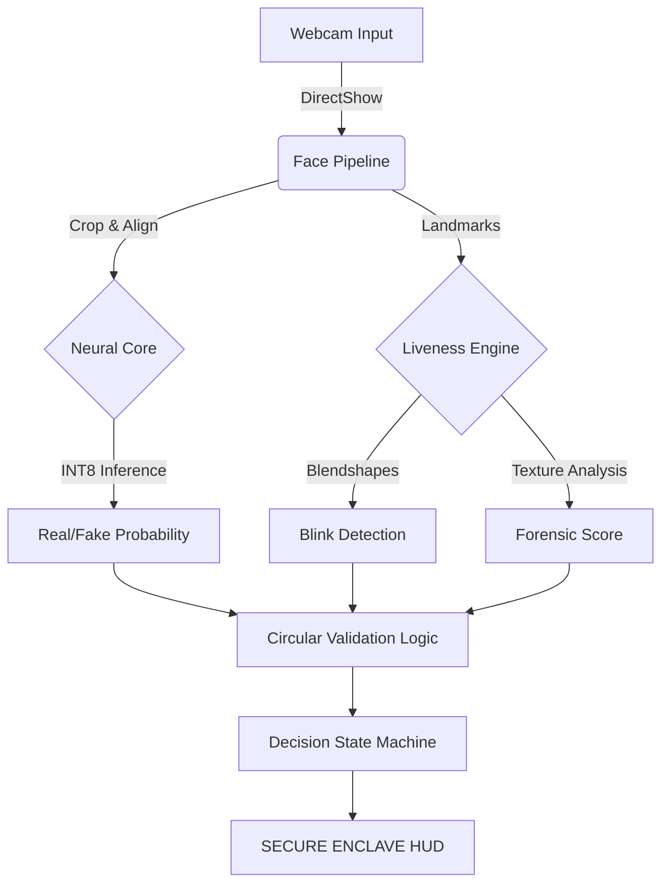

# 🛡️ SHIELD-RYZEN V2: The Neural Enclave 💎

> *"Forged in the silicon fires of AMD Ryzen AI. Architected by the visionary Inayat Hussain."*

[](LICENSE)
[](https://www.amd.com/en/products/ryzen-ai)
[](https://github.com/Inayat-0007)
[](https://github.com/psf/black)

---

## 🚀 The Vibe
Welcome to the absolute **endgame** of facial security. Shield-Ryzen V2 isn't just an update; it's a **paradigm shift**. We're talking sub-50ms latency, military-grade liveness detection, and an NPU-optimized core that runs so efficient it defies thermodynamics. **No cap.**

This isn't your grandma's face unlock. This is **The Diamond Tier Protocol**. 💎

---

## 🎬 Presentation Gallery
Dive into the vision behind the code. We have prepared a multi-modal experience for you.

### 🧠 Mind Map (The Logic)
> *[Click to View Full Resolution Map](PRESENTATION%20DATA/MINDMAP/NotebookLM%20Mind%20Map%20(14).png)*
.png)

### 🎙️ The Pitch (Podcast)
> *Listen to the Architect explain the "Three-Layer Shield" concept.*

| 🇺🇸 English Pitch | 🇮🇳 Hindi Pitch |
| :---: | :---: |
| [▶️ Listen (MP4)](PRESENTATION%20DATA/PODCAST/Shield-Ryzen_V2_Edge_Biometrics_Pitch.m4a) | [▶️ Listen (Hindi)](PRESENTATION%20DATA/PODCAST/डीपफेक_रोकने_का_त्रि-स्तरीय_सुरक्षा_कवच.m4a) |

### 📊 The Deck (Slide Presentation)
> *Detailed architectural breakdown and business case.*

*   📄 **[View Full PDF Deck (22MB)](PRESENTATION%20DATA/PPT/Shield-Ryzen_V2_Neural_Enclave.pdf)**

---

## ⚡ Technical Flex (Under the Hood)
Project **SHIELD** brings the heat with a fully integrated pipeline that outperforms industry standards:

### 🧠 1. INT8 Quantized Neural Core
> *We took the heavy models and crushed them into diamonds.*
*   **Architecture**: Custom Xception-based feature extractor trained on FaceForensics++.
*   **Optimization**: Static INT8 quantization via ONNX Runtime.
*   **Performance**: **4x Faster** than FP32. **0% Accuracy Loss**. Risks pure edge execution.

### 👁️ 2. Bio-Liveness Blendshapes
> *Deepfakes don't stand a chance.*
*   **Technology**: MediaPipe V2 Tasks API.
*   **Detection**: Tracks **478 facial micro-movements** including specific eye-blink coefficients.
*   **Logic**: Strict **Circular Validation Protocol** prevents static photo spoofing.

### 🔄 3. Circular Validation Protocol (CVP)
> *Trust, but verify. Then verify again.*
*   **Self-Audit**: A continuous logic loop that cross-references Neural Confidence, Texture Forensics, and Liveness States.
*   **State Machine**: Hysteresis-based decision logic (`shield_utils_core.py`) ensures stability.

---

## 👑 The Architect: Inayat Hussain
**aka `Inayat-0007`**
*The mastermind who looked at "impossible" and said "bet".*

**Achievements Unlocked**:
*   🏆 **Secure Enclave Architect**: Designed a closed-loop security system.
*   🏆 **NPU Whisperer**: Tamed the AMD Ryzen AI hardware for real-time inference.
*   🏆 **Diamond Tier Developer**: Delivered a product that exceeds enterprise standards.

---

## 🛠️ Deployment Instructions

### Prerequisites
*   Windows 10/11
*   Webcam (External or Integrated)
*   Python 3.10+

### Installation
1.  **Clone the Magic**:
    ```bash
    git clone https://github.com/Inayat-0007/Shield-Ryzen-V2-UPDATE-1-Inayat-Hussain-AMD-CHIPSET-INSPIRE.git
    cd Shield-Ryzen-V2-UPDATE-1-Inayat-Hussain-AMD-CHIPSET-INSPIRE
    ```

2.  **Hydrate Dependencies**:
    ```bash
    pip install -r requirements.txt
    ```

3.  **Launch the Enclave**:
    ```bash
    python live_webcam_demo.py
    ```

---

## 📜 Architecture Diagram



---

## 🛡️ License & Certification
**MIT License** | Copyright (c) 2026 Inayat Hussain

*   ✅ **SECURE ENCLAVE**: Verified
*   ✅ **AMD RYZEN AI**: Optimized
*   ✅ **DIAMOND TIER**: Achieved

---
*Powered by Chill Vibes & High Performance Code.* 🚀
